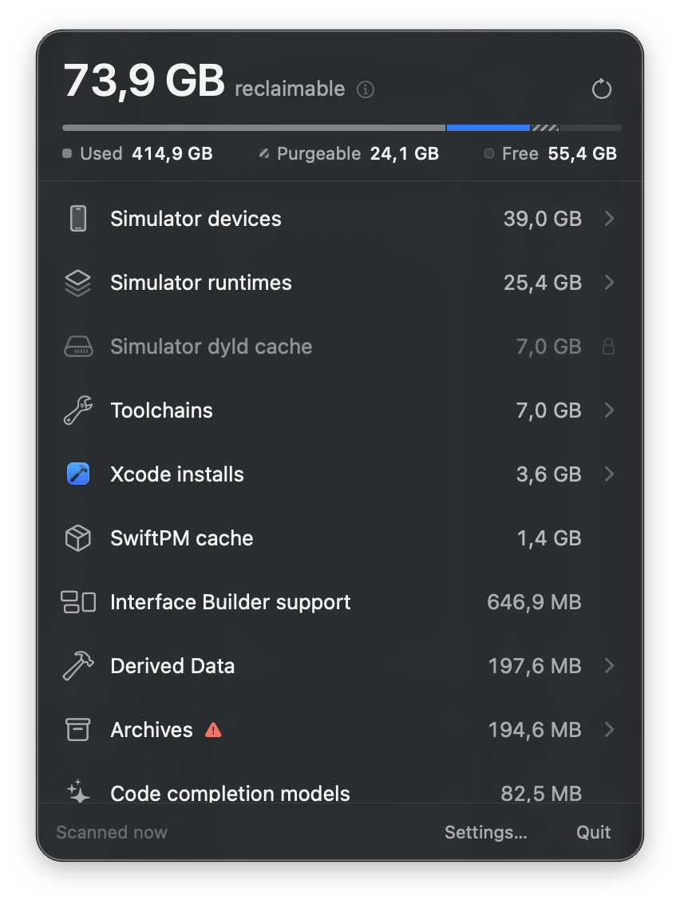
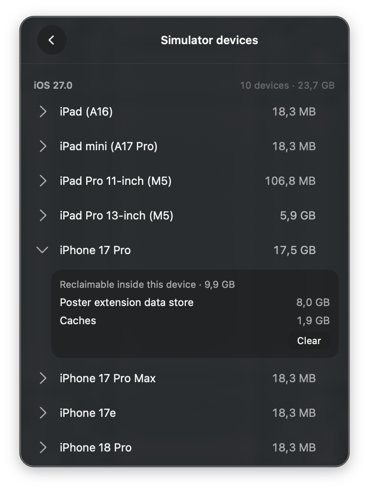
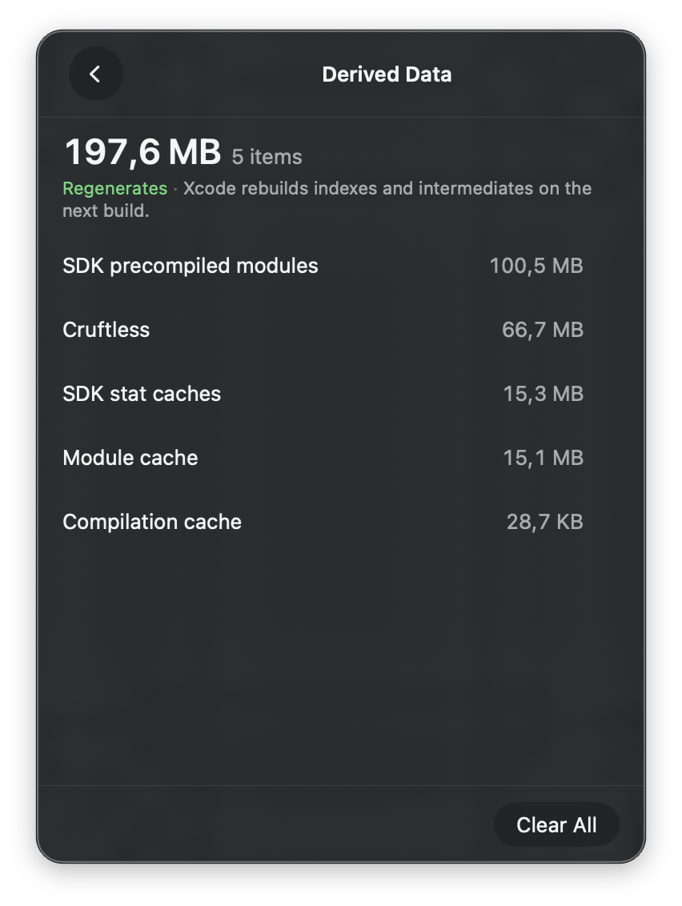

# Cruftless

Cruftless is a native macOS menu bar app for finding and removing disk space
used by Xcode and CoreSimulator. It shows what can be reclaimed, explains the
consequence of each action, and asks for confirmation before permanently
deleting anything.

> [!IMPORTANT]
> Cruftless is pre-release software. It is not yet distributed as a signed app;
> for now, build it from source.

<p align="center">
  
  
  
</p>

## Highlights

- Lives in the menu bar and scans automatically after launch.
- Breaks usage down by project, simulator, runtime, toolchain, and cache.
- Distinguishes regenerable data from downloads, app data, and irreversible
  files.
- Shows APFS allocated size instead of misleading logical file size.
- Reports purgeable disk space separately from free space.
- Lets you protect additional folders in Settings.
- Runs locally, with no account, cloud service, analytics, or telemetry.

## What Cruftless scans

| Location | How Cruftless handles it |
|---|---|
| Device Support | Delete; Xcode recreates it when the device reconnects. |
| Simulator devices | Clear known caches, erase a device, or delete it through `simctl`. |
| Simulator runtimes | Delete through `simctl`; unusable runtimes are supported. |
| Derived Data | Delete by project or clear the location; Xcode rebuilds it. |
| Previews cache | Delete; Xcode Previews regenerates it. |
| Toolchains | Delete installed toolchains; the active toolchain gets an explicit warning. |
| SwiftPM cache | Delete; packages are downloaded again when they resolve. |
| Interface Builder support | Delete; Interface Builder rebuilds it on demand. |
| Archives | Delete individually with a warning; archives and dSYMs cannot be recovered. |
| Code completion models | Delete with a warning about assistant data and settings. |
| Build products and logs | Delete build output, logs, and caches; device logs do not regenerate. |
| Xcode installs | Inspect and reveal in Finder; Cruftless does not delete the app. |
| Simulator dyld cache | Inspect only; Cruftless provides a command for this root-owned data. |

Entries are sorted by reclaimable size. Drill-downs let you inspect individual
items before deciding what to remove.

## Safety model

Cruftless permanently deletes files because moving them to Trash does not free
disk space until the Trash is emptied. That makes the deletion boundary the
most important part of the project:

- Every deletion starts with an explicit action and goes through a review
  screen. Scanning never deletes anything.
- A path guard restricts deletion to known Xcode and simulator roots, resolves
  paths before comparison, rejects symlink targets, and refuses protected
  locations.
- The filesystem identity of a target is checked again immediately before
  deletion so an item that changed after the scan is refused.
- Simulator devices and runtimes are mutated through Apple's `simctl`, not by
  recursively deleting CoreSimulator directories.
- Irreversible items such as Archives are flagged, explained, and excluded from
  whole-location actions.
- Batch work records each result instead of stopping after the first failure.

You can add your own protected folders in **Settings → General**. Any deletion
that contains a protected folder is refused rather than silently excluding part
of the requested item.

## About the numbers

Cruftless measures allocated disk usage, including filesystem metadata, and
deduplicates hardlinks by volume and inode. APFS does not expose a public API
for identifying clone-shared extents, so totals involving clones are an upper
bound. The app keeps purgeable space separate because macOS already includes it
in the reported free-space figure.

## Requirements

- macOS 26 or later
- Xcode 26 with Swift 6.4 or later

## Build from source

```bash
git clone https://github.com/danmunoz/cruftless.git
cd cruftless
make run
```

`make run` builds the `Cruftless` scheme and opens the resulting app. Cruftless
appears in the menu bar rather than the Dock.

## Development

The repository keeps filesystem and deletion logic independent from the UI:

| Path | Purpose |
|---|---|
| `CruftlessCore/` | Swift package for scanning, inventory, planning, deletion, and naming. |
| `Cruftless/` | SwiftUI menu bar app and Settings window. |
| `scripts/` | Maintainer tools, including device-table generation. |

Run the full validation suite with:

```bash
make lint
make test
make build
```

Formatting is available separately through `make fmt`.

## Contributing

Cruftless is a small, independent project, and thoughtful contributions are
very welcome. If you find a bug, have an idea, or know about an Xcode-related
folder the app is missing, please open an issue and tell me about it. Pull
requests are welcome too.

Because Cruftless permanently deletes files, I am deliberately conservative
about changes to its deletion logic. For anything substantial, please start
with an issue so we can agree on the behavior and safety boundary first.
Deletion-path changes need focused tests, and every new tracked location must
prove that paths outside its allowed root are rejected. Filesystem work belongs
in `CruftlessCore`; bug fixes should include a regression test whenever
practical.

## Contact

Hi, I’m [Daniel](https://www.danmunoz.com), the indie developer behind
Cruftless. I’m based in Berlin and always happy to hear from people using the
app. If you have a question, found something odd, or just want to say hello,
you can reach me here:

- **Mastodon:** [@danmunoz@mastodon.social](https://mastodon.social/@danmunoz)
- **Twitter:** [@Makias](https://twitter.com/Makias)
- **Website:** [danmunoz.com](https://www.danmunoz.com)

If you’ve found a bug or have a feature idea, I’d prefer a
[GitHub issue](https://github.com/danmunoz/cruftless/issues) so the conversation
can help other people too.

## Acknowledgements

- **Menu bar icon:** “Clean” by [Icons8](https://icons8.com).
- **Device-identifier table:** generated from local CoreSimulator device
  profiles plus a baseline of historical models from
  [DeviceKit](https://github.com/devicekit/DeviceKit) (MIT).

## License

Cruftless is available under the MIT License. See [LICENSE](LICENSE).
